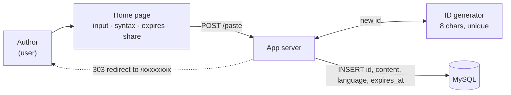
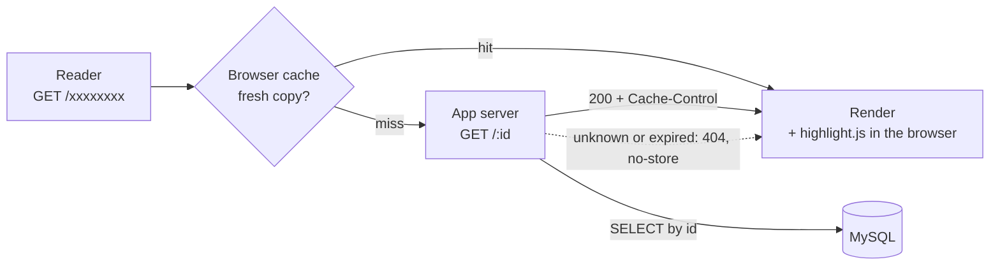

# pastebin

This is a working implementation of the Pastebin design from
[system-design-primer](https://github.com/donnemartin/system-design-primer/blob/master/solutions/system_design/pastebin/README.md).

## Design (v1)

### Write flow



The home page form posts to `POST /paste`. The server generates an 8-character ID, saves the paste to MySQL, and redirects to `/<id>`, where the share link is shown.

### Read flow



`GET /<id>` loads the paste from MySQL and renders it. The response carries `Cache-Control: private, max-age=…`, capped at 24 hours and never past the paste's expiry. Within that window the reader's browser can serve repeat visits from its own cache.

Syntax highlighting runs in the browser (highlight.js, vendored under `handlers/static/vendor`). The server only stores the language name, so the read path stays a single `SELECT` with no highlighting work.

## Run

```sh
make build    # build the app image
make run      # start app + MySQL in the background (rebuilds if code changed) → http://localhost:8080
make stop     # stop the containers, keep them and the data
make remove   # delete containers, network, MySQL data volume and the app image
```

`./scripts/smoke.sh` runs an end-to-end check against the running stack.

## Configuration

| Variable | Default |
|---|---|
| `PORT` | `8080` |
| `BASE_URL` | `http://localhost:8080` |
| `DB_HOST` / `DB_PORT` | `localhost` / `3306` |
| `DB_USER` / `DB_PASSWORD` / `DB_NAME` | `pastebin` / `pastebin` / `pastebin` |

## Develop

```sh
go test ./...
```

## Layout

| Path | What |
|---|---|
| `main.go` | entrypoint: wires the pieces together in order |
| `environments` | settings read from env vars |
| `routes/api.go` | URL → handler mapping |
| `handlers` | request handling, HTML templates, static assets (CSS, JS, highlight.js), `Cache-Control` |
| `internal/providers` | startup steps: DB connection, middlewares, renderer, server start/shutdown |
| `internal/idgen` | random 8-char base62 IDs |
| `internal/paste` | create with a unique ID (retries on collision), read with expiry check |
| `internal/mysqlstore` | MySQL implementation of the paste store |
| `migrations` | schema, applied by the MySQL container on first start |
