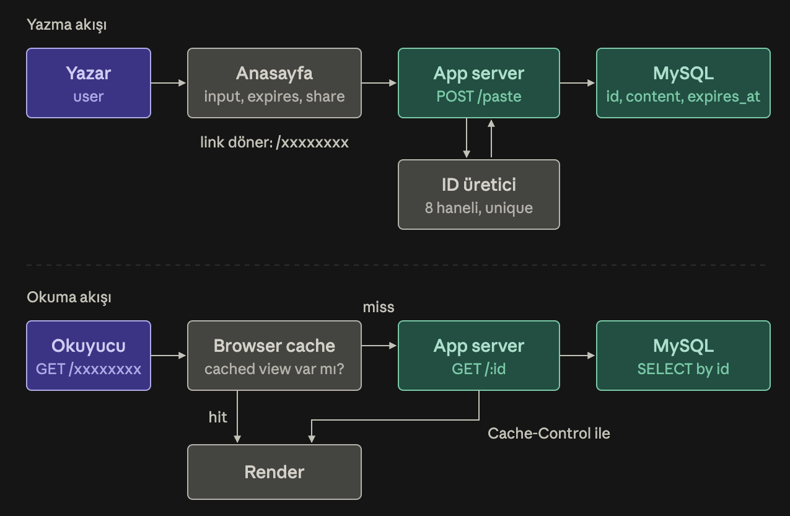

# pastebin-system-design

This is a working implementation of the Pastebin design from
[system-design-primer](https://github.com/donnemartin/system-design-primer/blob/master/solutions/system_design/pastebin/README.md).

## Design (v1)



- **Write:** the home page form posts to `POST /paste`. The server generates an 8-character ID, saves the paste to MySQL, and redirects to `/<id>`.
- **Read:** `GET /<id>` loads the paste from MySQL and renders it. The response carries `Cache-Control: private, max-age=…`, so the reader's browser can serve repeat visits from its own cache. Expired pastes return 404.

## Run

```sh
docker compose up --build -d   # app on http://localhost:8080
./scripts/smoke.sh             # end-to-end check against the running stack
docker compose down            # stop (add -v to also wipe the MySQL volume)
```

## Develop

```sh
go test ./...
```

## Layout

| Path | What |
|---|---|
| `main.go` | entrypoint: config from env, Echo server setup, graceful shutdown |
| `routes/api.go` | URL → handler mapping |
| `handlers` | request handling, HTML templates, `Cache-Control` |
| `internal/idgen` | random 8-char base62 IDs |
| `internal/paste` | create with a unique ID (retries on collision), read with expiry check |
| `internal/mysqlstore` | MySQL implementation of the paste store |
| `migrations` | schema, applied by the MySQL container on first start |
